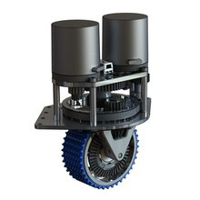

# Swerve Module


*Pictured: A Swerve Module*

**The core of any swerve drive system is the swerve module**. As wings are to a bee, swerve modules are to a swerve drive system. The major components of a swerve module are as follows:
- Wheel: Somewhat self-explanatory
- Drive Motor: One of the two motors in a Swerve Module. Controls how fast the wheel spins.
- Angle Motor: The second of a Swerve Module's motors. Controls how fast the wheel rotates.
- Encoders: Sense the position of the wheel, or its velocity.
    - Absolute Encoder: Measures the rotation of the wheel, or where it's pointing, by using a magnet. Does not reset when the robot is turned on.
    - Angle Encoder: Measures the roation of the wheel, relative to where it was when it was last turned on.
    - Drive Encoder: Measures how far the wheel has spun, relative to where it was when it was last turned on.

 In essence, code for a Swerve Module needs to do the following:
- Report values from encoders(eg: 60 deg, 2.5 meters)
- Set the wheel to a specific rotation(eg: 60 deg) and speed(eg: 2.5 meters/second)

The code for a Swerve Module is stored in the `src/main/kotlin/frc/lib/basics/SwerveModule.kt` file. 

*But what does each part do?*

**1. Lines 24-60 (Setup)**:
```kt
class SwerveModule(val moduleConstants: SwerveDriveConstants.ModuleConstants) {

    //shuffleboard
    private val ShuffleboardTab = Shuffleboard.getTab("Swerve Module" + (moduleConstants.MODULE_NUMBER))
    val setPointEntry:GenericEntry = ShuffleboardTab.add("Setpoint", 0.0).withWidget(BuiltInWidgets.kEncoder).withProperties(mapOf("Min" to 0.0, "Max" to 360.0)).entry


    private val driveMotor:CANSparkMax = CANSparkMax(moduleConstants.DRIVE_MOTOR_ID, CANSparkMaxLowLevel.MotorType.kBrushless)
    private val angleMotor:CANSparkMax = CANSparkMax(moduleConstants.ANGLE_MOTOR_ID, CANSparkMaxLowLevel.MotorType.kBrushless)

    private val driveEncoder:RelativeEncoder = driveMotor.encoder
    private val angleEncoder:RelativeEncoder = angleMotor.encoder

    private val absoluteEncoder:AnalogEncoder = AnalogEncoder(moduleConstants.ENCODER_ID)

    private var turnController:PIDController = moduleConstants.PID_CONTROLLER

    init {
        absoluteEncoder.distancePerRotation = SwerveDriveConstants.EncoderConsts.POSITION_CONVERSION_FACTOR_DEGREES_PER_ROTATION
        absoluteEncoder.positionOffset = moduleConstants.ANGLE_OFFSET.degrees
        driveEncoder.positionConversionFactor = SwerveDriveConstants.DriveMotorConsts.POSITION_CONVERSION_FACTOR_METERS_PER_ROTATION
        driveEncoder.velocityConversionFactor = SwerveDriveConstants.DriveMotorConsts.VELOCITY_CONVERSION_FACTOR_METERS_PER_SECOND
        angleEncoder.positionConversionFactor = SwerveDriveConstants.AngleMotorConsts.POSITION_CONVERSION_FACTOR_DEGREES_PER_ROTATION

        driveMotor.inverted = moduleConstants.DRIVE_MOTOR_REVERSED
        angleMotor.inverted = moduleConstants.ANGLE_MOTOR_REVERSED

        driveMotor.setOpenLoopRampRate(0.9)
        angleMotor.setOpenLoopRampRate(0.9)

        turnController.enableContinuousInput(
            -180.0,180.0
        )

        //todo: get this to work(https://github.com/orgs/frc3268/projects/2/views/1?pane=issue&itemId=43651204)
        ShuffleboardTab.add("Absolute Encoder", absoluteEncoder).withWidget(BuiltInWidgets.kEncoder)

    }
```
In this section, we declare the SwerveModule class, as well as the variables for the Drive Motor, Angle Motor, Drive Encoder, Angle Encoder, and Absolute Encoder, as well as for the PID controller which will control how fast we rotate the wheel(that'll come up later). In the `init` block, called once an instance of the SwerveModule is created, contains the setting of some constants to our previously declared variables. Specifically, we set the conversion factors for the encoders(because encoders measure in "native units", not meters or degrees), the offset for our Absolute Encoder(because the zero it reports needs to match up with the wheel pointed towards 0 degrees) as well as the Ramp Rate(or how fast a given motor is allowed to accelerate) for our motors.

**2. Lines 61-67 (Encoder Functions)**
```kt
fun resetToAbsolute(){
        driveEncoder.position = 0.0
        angleEncoder.position = getAbsoluteEncoderMeasurement().degrees
    }
    private fun getAbsoluteEncoderMeasurement() : Rotation2d = ((absoluteEncoder.absolutePosition * 360.0) + moduleConstants.ANGLE_OFFSET.degrees).rotation2dFromDeg()
    fun getState() : SwerveModuleState = SwerveModuleState(driveEncoder.velocity, scopeAngle(angleEncoder.position.rotation2dFromDeg()))
    fun getPosition() : SwerveModulePosition = SwerveModulePosition(driveEncoder.position, scopeAngle(angleEncoder.position.rotation2dFromDeg()))

```
This section contains four functions which are used to interact with the Swerve Module's encoders. The first of them, `resetToAbsolute`, calibrates the Drive and Angle Encoders by resetting the position reported by the Drive Encoder to 0(as if the wheel had not spun since the robot was turned on) and by setting the position reported by the Angle Encoder to the position reported by the Absolute Encoder. If the latter action was not taken, we would have to manually reset the rotation of the wheels every time we turned the robot on. The next three functions deal with obtaining the values reported by the Encoders. While `getAbsoluteEncoderMeasurement` is hopefully self explanatory, the others are a little more opaque. `getState` returns an ordered pair of the wheel's velocity(how fast it's spinning) and it's rotation, while `getPosition` returns an ordered pair of the wheel's position and it's rotation(how far it has spun). The `scopeAngle` function is used in both of those functions in order to turn Encoder values which might lie outside of the 0-360 degree scope into ones which do(via recursion).

**3. Lines 69-83 (Movement Functions)**
```kt
fun setDesiredState(desiredState:SwerveModuleState){
        if (abs(desiredState.speedMetersPerSecond) < 0.01){
            stop()
            return
        }
        val optimizedState = SwerveModuleState.optimize(desiredState, getState().angle)
        setPointEntry.setDouble(optimizedState.angle.degrees)
        //TODO: 5.0 should be a const
        driveMotor.set(optimizedState.speedMetersPerSecond / 5.0)
        angleMotor.set(turnController.calculate(getState().angle.degrees, optimizedState.angle.degrees))
    }
    fun stop(){
        driveMotor.set(0.0)
        angleMotor.set(0.0)
    }
```
This section, which is the most impactful(i.e: the most likely to cause errors), contains two functions which concern the movement of the Swerve Module's wheel. The first function, `setDesiredState`, takes several actions to, as the name suggests, set the state(the same kind as in `getState`) of the Swerve Module to a given `desiredState`. First, it makes sure that the `desiredState`'s speed is not lower than 0.01 meters per second, so as to prevent accidental inputs from causing the wheels to move. After that, it calls the `optimize` function, which changes the wheel speed and angle of the `desiredState` to minimize the distance that the wheel would have to rotate. For example, if the wheel was at a 0 degree angle, and the `desiredState` called for a speed of x and a rotation of 180 degrees, the `optimize` function would return a state with a speed of -x and an angle of 0 degrees. The result of the `optimize` function is stored in the `optimizedState` variable. Then, the Drive Motor and Angle Motor's `set` functions are called, with the relevant parts of the `optimizedState` being passed in. Because the `set` function takes in a value from -1 to 1, the value passed to the Drive Motor's `set` function is the `optimizedState`'s speed, divided by the maximum speed of the wheel(in meters per second). By contrast, the Angle Motor uses a the PID controller from before to calculate a value to pass into `set` in order to get the wheel's rotation to match the rotation specified in the `optimizeState` function.
The `stop` function is less complicated, simply calling the `set` functions for the Angle and Drive motors in order to stop both motos, thus bringing the wheel to a halt.

